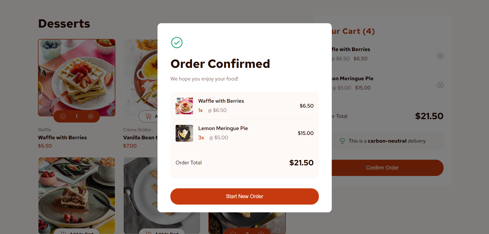

# Frontend Mentor - Product list with cart solution

This is a solution to the [Product list with cart challenge on Frontend Mentor](https://www.frontendmentor.io/challenges/product-list-with-cart-5MmqLVAp_d). Frontend Mentor challenges help you improve your coding skills by building realistic projects. 

## Table of contents

- [Overview](#overview)
  - [The challenge](#the-challenge)
  - [Screenshot](#screenshot)
  - [Links](#links)
- [My process](#my-process)
  - [Built with](#built-with)
  - [What I learned](#what-i-learned)
  - [Continued development](#continued-development)
  - [AI Collaboration](#ai-collaboration)
- [Author](#author)

## Overview

### The challenge

Users should be able to:

- Add items to the cart and remove them
- Increase/decrease the number of items in the cart
- See an order confirmation modal when they click "Confirm Order"
- Reset their selections when they click "Start New Order"
- View the optimal layout for the interface depending on their device's screen size
- See hover and focus states for all interactive elements on the page

### Screenshot



### Links

- Solution URL: [Repo](https://github.com/otaviozerotwo/Product-list-with-cart)
- Live Site URL: [Deploy](https://product-list-with-cart-psi-taupe.vercel.app/)

## My process

### Built with

- Semantic HTML5 markup
- CSS custom properties (two-layer design tokens: primitive & semantic)
- Flexbox & CSS Grid
- Mobile-first workflow
- [React](https://reactjs.org/) (Vite)
- [Zustand](https://github.com/pmndrs/zustand) - Minimalist state management library

### What I learned

This project provided valuable hands-on experience in global state architecture, derived computations, and modern CSS problem-solving:

#### 1. Single Source of Truth with Zustand
Initially, the `Card` component used local `useState` hooks for its selected state and quantity count. When an item was removed directly from the `Cart`, the card failed to reset to 1 because its local state wasn't notified.

By replacing local state with derived state directly from the Zustand store (`desserts.some()` and `desserts.find()`), the UI stays synchronized seamlessly:

```jsx
// Deriving state directly from the global store
const itemInCart = desserts.find((dessert) => dessert.name === name);
const isItemInCart = Boolean(itemInCart);
const quantity = itemInCart ? itemInCart.quantity : 1;
```

#### 2. Derived Calculations with `Array.prototype.reduce()`
Instead of syncing redundant state variables for subtotals, total item counts, and order totals, these values are computed on the fly using pure helper functions:

```js
export const calculateOrderTotal = (items) => {
  return items.reduce((acc, cur) => {
    return acc + (cur.price * cur.quantity);
  }, 0);
};

export const calculateTotalQuantity = (items) => {
  return items.reduce((acc, cur) => acc + cur.quantity, 0);
};
```

#### 3. Solving Flexbox Text Truncation with `min-width: 0`
In CSS Flexbox, flex items default to `min-width: auto`, preventing them from shrinking below their content's natural size. When applying `text-overflow: ellipsis` to long product names, the text would push neighboring elements (such as item prices) out of view.

Setting `min-width: 0` on parent flex containers and `flex-shrink: 0` on the price resolved this issue smoothly:

```css
.modal-item-data {
  display: flex;
  gap: 1rem;
  min-width: 0;
  flex-grow: 1;
}

.modal-item-name {
  font-weight: 600;
  white-space: nowrap;
  overflow: hidden;
  text-overflow: ellipsis;
}
```

#### 4. Handling Scrollbars and `border-radius` in Modals
Adding `overflow-y: auto` directly onto an element with `border-radius` caused browser scrollbars to clip the curved corners. By nesting a scrollable `.modal-content` inside a rounded `.modal-container` with padding, the scrollbar remains neatly inset without breaking the visual curvature.

### Continued development

- **Accessibility (a11y):** Adding keyboard focus traps (`focus-trap-react` or native `<dialog>`) and ARIA live regions for screen readers when cart quantities change.
- **Micro-animations:** Incorporating smooth transitions and exit animations using CSS keyframes or animation libraries for cart item additions/removals.
- **Zustand Selectors:** Leveraging shallow selectors to optimize render performance when applications scale up.

### AI Collaboration

Throughout this project, I used an AI pair-programming assistant as an interactive mentor and technical sounding board:

- **Concept Clarification & Problem-Solving:** Rather than generating boilerplate solutions, the assistant guided me through debugging state synchronization issues between local React state and the global Zustand store.
- **CSS Edge Cases:** Discussed root causes for real-world styling quirks (such as the interaction between `min-width: auto`, Flexbox, and `text-overflow: ellipsis`, as well as scrollbar gutter clipping with `border-radius`).
- **Best Practices:** Brainstormed clean design token conventions (primitive vs. semantic color variables) and component refactoring (e.g., extracting `DessertList` according to the Single Responsibility Principle).

## Author

- GitHub - [@otaviozerotwo](https://github.com/otaviozerotwo)
- Frontend Mentor - [@otaviozerotwo](https://www.frontendmentor.io/profile/otaviozerotwo)